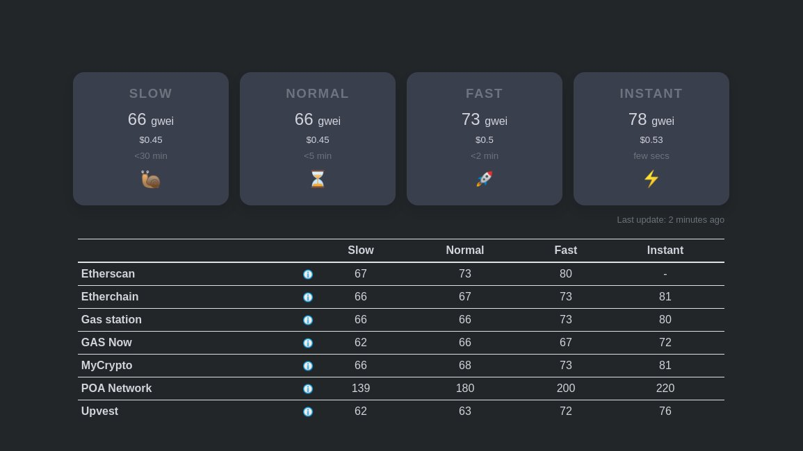

# manifold.finance overview

manifold.finance is an aggregated gas price feed that checks multiple data sources for the latest gas prices. By aggregating these data sources, it provides a more reliable, median gas price.

Visit [ywei.io](https://ywei.io/)

